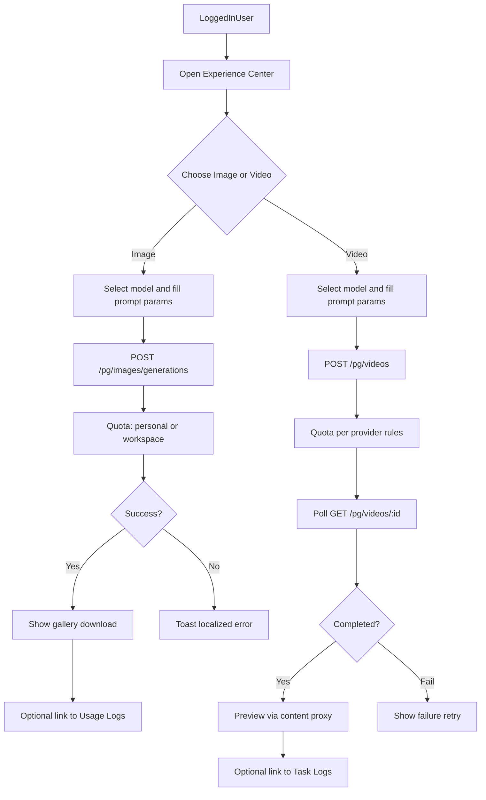

# 体验中心（Experience Center）设计

**文档状态**：**已确认**（2026-08-14）；可按 §9 分期开工（建议先 M1 图片）  
**范围**：左侧菜单新增独立一级「体验中心」；一期仅 OpenAI 兼容 **图片生成** 与 **视频生成**  
**对标现网**：Playground（登录态 `/pg/chat/completions` + session Bearer + `IsPlayground` 计费）  
**相关文档**：[frontend-i18n-standard.md](./frontend-i18n-standard.md)、[customer-workspace-design.md](./customer-workspace-design.md)（额度 / 工作区扣费）  

---

## 1. 目标与非目标

### 1.1 目标

1. 在控制台左侧提供 **体验中心**，降低「先建令牌再 curl」的试用成本。  
2. 登录用户可直接生成 **图片 / 视频**，结果可预览、下载，并与现有日志体系打通。  
3. 鉴权与扣费对齐 Playground：**不强制**用户粘贴 API Key；按个人或当前工作区额度扣费。  
4. 复用现有 OpenAI 兼容 relay 与选渠 / BYOK / `upstream_source`，不新开一套渠道栈。

### 1.2 非目标（一期不做）

| 不做 | 说明 |
| --- | --- |
| Midjourney / Kling / Jimeng / Suno 专用 UI | 厂商协议差异大，归二期 |
| 对外免登录公开体验页 | 仍需登录；无独立营销落地页 |
| 复杂工作流 / 批量队列 / 素材库 | 一期单次生成即可 |
| 替换 `/v1` 对外 API | 体验中心是控制台能力，不改变客户集成方式 |
| 改造 Chat Playground 本身 | 体验中心与 Chat 分组并列，互不吞并 |

### 1.3 已锁定决策

| 项 | 结论 |
| --- | --- |
| 菜单位置 | 左侧 **独立一级分组** Experience Center / 体验中心 |
| 子菜单 | Image Generation / 图片生成；Video Generation / 视频生成 |
| 一期协议 | 仅 OpenAI 兼容：`images/generations`；视频 `POST/GET /videos`（异步 + 轮询 + 内容预览） |
| 鉴权扣费 | 登录态 `/pg/...`，对齐 Playground；不强制 API Key |
| image edits / video remix | **一期不做**（§10 已确认排除） |
| 页面布局 | **左表单 + 右结果画布**（移动端上表单下结果）；见 §5.0 |

---

## 2. 与现网能力关系

| 能力 | 现状 | 体验中心用法 |
| --- | --- | --- |
| Chat Playground | `/playground` → `POST /pg/chat/completions` | 模式对标；体验中心不复用该页面 |
| 图片 relay | `POST /v1/images/generations`（`TokenAuth`） | 新增 `/pg/images/...` 包装，内部走同一 relay |
| 视频 relay | `POST /v1/videos`、`GET /v1/videos/:id`；内容 `GET /v1/videos/:task_id/content`（已支持 `TokenOrUserAuth`） | 新增 `/pg/videos` 提交/查询；内容预览可继续用现有 content 代理 |
| 使用日志 / 任务日志 | `/usage-logs/common`、`/usage-logs/task`、`/usage-logs/drawing` | 图片进普通消费日志；视频进任务日志；页内提供「查看日志」入口 |
| 客户 / 工作区 / BYOK | M1 已交付 | 与 Playground 相同计费与选渠上下文 |

---

## 3. 信息架构

### 3.1 侧栏

在 `useSidebarData` 的 `navGroups` 中新增分组（建议插在 `chat` 与 `general` 之间）：

```text
Experience Center / 体验中心          id: experience
  ├── Image Generation / 图片生成     /experience/images
  └── Video Generation / 视频生成     /experience/videos
```

- 图标建议：分组可用 `Sparkles` / `Images`；子项可用 `Image`、`Video`（Lucide）。  
- i18n：英文原文即 key（`Experience Center`、`Image Generation`、`Video Generation`），中英同步写入 `en.json` / `zh.json`。  
- **不**并入现有 `chat` 分组，避免与 Playground / Chat presets 混淆。

### 3.2 `sidebar_modules` 约定

在 [web/src/hooks/use-sidebar-config.ts](../../web/src/hooks/use-sidebar-config.ts) 的默认配置中新增：

```ts
experience: {
  enabled: true,
  images: true,
  videos: true,
}
```

- URL 映射：`/experience/images` → `experience.images`；`/experience/videos` → `experience.videos`。  
- 过滤规则与现网一致：admin 总开关 × 用户 `sidebar_modules` 收窄。  
- 系统设置中「侧栏模块」编辑器需能开关本分组（实现阶段同步 `static-keys` / 设置 UI）。

### 3.3 路由

| 路径 | 页面 | 鉴权 |
| --- | --- | --- |
| `/experience/images` | 图片生成 | 登录（`_authenticated`）+ 模块可见 |
| `/experience/videos` | 视频生成 | 同上 |

建议 feature 目录：`web/src/features/experience/`（`images-page.tsx`、`videos-page.tsx`、共享 components / api）。

旧路径：无历史别名需求；不占用 `/console/midjourney` 等已有 redirect。

---

## 4. 用户流程



**工作区上下文**：若用户属于客户且 UI 已选定工作区（与令牌 / Playground 一致），请求携带当前工作区语义，扣工作区池；否则个人模式扣 `User.Quota`。

---

## 5. 页面布局与功能规格

### 5.0 页面布局（已确认）

桌面：**左右分栏**；手机：**上表单、下结果**（结果区占满宽）。

共用骨架：

```text
┌─ 页头（标题 + 一句说明 +「查看日志」链接）─────────────────────┐
│                                                                   │
│  ┌─ 左侧控制栏（约 360–400px）─┐  ┌─ 右侧结果区（弹性撑满）─┐  │
│  │ 模型                         │  │ 空态 / 加载 / 结果        │  │
│  │ Prompt                       │  │                         │  │
│  │ 参数                         │  │                         │  │
│  │ [生成] [取消]                 │  │                         │  │
│  └──────────────────────────────┘  └─────────────────────────┘  │
└───────────────────────────────────────────────────────────────────┘
```

与 Chat Playground 的差别：Playground 为「上对话流 + 底输入」；体验中心为「**左表单 + 右画布**」，不做多轮会话。

#### 图片页布局细节

```text
左：模型 → Prompt → size / quality / n → [Generate]
右：空态 或 loading 或 图片网格（n>1）+ 单图预览 / 下载
```

- 页头次要链接：「在使用日志中查看」→ `/usage-logs/common`  
- 右栏失败：简短错误摘要；同时 toast  

#### 视频页布局细节

```text
左：模型 → Prompt → duration / resolution → [Generate]
右：状态进度（queued → processing → completed/failed）→ 单路 <video> 预览 + 下载
```

- 页头次要链接：「在任务日志中查看」→ `/usage-logs/task`  
- 右栏为**单路视频**（非多图网格）；失败可改参重试  

### 5.1 图片生成（`/experience/images`）

| 区块 | 要求 |
| --- | --- |
| 模型选择 | 仅列出当前用户可用、且支持 OpenAI Image 端点的模型（数据源对齐定价 / 能力接口；不可用时禁用提交） |
| 输入 | Prompt 必填；可选 negative（若上游支持再展示，否则隐藏） |
| 参数 | `size` / `quality` / `n` 等按所选模型能力动态展示；未知能力时给保守默认值 |
| 操作 | Generate；生成中禁用重复提交；可取消进行中的请求（abort） |
| 结果 | 画廊展示（URL 或 b64）；支持下载；多图时网格 |
| 失败 | toast + 结果区错误摘要；遵循 i18n / `apiErrorMessage` |
| 辅助 | 「在使用日志中查看」链到 `/usage-logs/common`（可带时间或粗过滤，能打开即可） |
| 空态 | 未生成时的简短说明（一句） |

一期 **不含**：image edits / variations / mask 涂抹、本地上传参考图。

### 5.2 视频生成（`/experience/videos`）

| 区块 | 要求 |
| --- | --- |
| 模型选择 | 仅 OpenAI 兼容视频模型（走 `/videos` 任务链路） |
| 输入 | Prompt 必填 |
| 参数 | 时长、分辨率、秒数等按模型能力展示 |
| 提交 | `POST /pg/videos` → 返回 `task_id` / video id |
| 进度 | 前端轮询 `GET /pg/videos/:id`（间隔建议 2–5s，页面不可见时降频或暂停） |
| 结果 | 完成后用现有 content 代理预览（`TokenOrUserAuth` 已支持用户态）；提供下载（若上游给文件 URL） |
| 失败 | 展示上游/网关错误；允许改参重试 |
| 辅助 | 「在任务日志中查看」→ `/usage-logs/task` |

一期 **不含**：remix、图生视频专用厂商页、多镜头时间线。

### 5.3 共享 UX 原则

- 一页一事：首屏 = **左表单 + 右结果**，不做仪表盘式多卡片、不做首屏统计条。  
- 不把体验中心做成「第二个渠道测试台」：不暴露上游 Key、渠道 ID（管理员调试仍用渠道页）。  
- 文案、toast、校验全面 i18n（见 §8）。

---

## 6. 后端接入

### 6.1 建议新增路由（Playground 风格）

| 方法 | 路径 | 说明 |
| --- | --- | --- |
| `POST` | `/pg/images/generations` | `UserAuth` + `Distribute`；标记 `IsPlayground`；复用 Image relay |
| `POST` | `/pg/videos` | 同上；复用 Video / Task relay |
| `GET` | `/pg/videos/:task_id` | 任务状态查询（用户态） |
| （复用） | `GET /v1/videos/:task_id/content` | 已有 `TokenOrUserAuth`，体验页可直接用 session Bearer |

实现要点：

1. 路径识别扩展：今日 distributor / relay mode 仅特殊处理 `/pg/chat/completions`，需把 `/pg/images/*`、`/pg/videos*` 纳入同一 Playground 语义（`IsPlayground=true`，不扣 API Token 余量）。  
2. **禁止**复制渠道适配器；只加路由与 auth 包装。  
3. 请求体字段与 OpenAI 兼容 JSON 对齐，便于前后端与文档一致。  
4. 错误响应与现网 relay 一致，前端再做 i18n 映射。

### 6.2 为何不直接调 `/v1` + 用户自建 Key

- 试用路径要求用户先建令牌，与「体验」目标相反。  
- Playground 已证明 session + `/pg` 可正确计费且不消耗令牌配额字段。  
- 对外集成仍只用 `/v1` + API Key，职责分离清晰。

### 6.3 安全

- 仅登录用户；无匿名。  
- 响应与日志 **不**回传上游 Key；BYOK 行为与 M1 一致。  
- 内容代理保持现有鉴权，防止未授权拉取他人 `task_id`（实现时复核归属校验是否已覆盖，缺口则补）。

---

## 7. 计费与客户 / 工作区

| 场景 | 扣费 |
| --- | --- |
| 个人用户（无客户） | `User.Quota` |
| 客户成员 + 已选工作区 | 工作区池（与 Playground / 工作区令牌一致） |
| BYOK / dedicated / shared | 选渠与 `upstream_source` 与现网一致 |

- 额度不足：拒绝生成并本地化提示。  
- 图片多为同步计费；视频按现有 Task 计费时点（预扣 / 结算）执行，UI 需容忍「先出任务再扣齐」的短暂状态。  
- 消费 / 任务日志应能区分来源（可选：`other` 中标记 `client=experience` 或复用 playground 标记——实现阶段定一种，便于运营统计）。

---

## 8. 权限、模块开关与 i18n

### 8.1 谁可见

- 任意已登录且通过 `sidebar_modules` 过滤的用户（含普通成员）。  
- 不要求 `SUPER_ADMIN`。  
- 客户成员无额外角色门槛（有额度即可试）。

### 8.2 i18n / 前端标准

- 遵循 [frontend-i18n-standard.md](./frontend-i18n-standard.md)。  
- 本功能是 **交互生成页**，不套用列表页标准；但错误 toast、表单 Label、空态、按钮必须 `t()`。  
- 侧栏与模块设置文案同步中英。

---

## 9. 分期建议

| 阶段 | 内容 | 粗估 |
| --- | --- | --- |
| **M1** | 侧栏分组 + 模块配置；`/pg/images/generations`；图片页可用 | 约 3–4 人天 |
| **M1.1** | `/pg/videos` + 轮询 + 预览；视频页可用；任务日志入口 | 约 3–4 人天 |
| **M2** | 厂商专用入口（MJ / Kling 等） | 另立设计文档 |

建议：**先合 M1 图片**，再开视频，避免一次改过多 distributor / relay 分支。

---

## 10. 开放项（已确认，按默认落地）

| # | 问题 | 结论 |
| --- | --- | --- |
| 1 | 一期是否包含 `images/edits`？ | **否** |
| 2 | 一期是否包含 video remix？ | **否** |
| 3 | 体验中心是否允许选择「用指定 API Key 调用」？ | **否**（始终 session `/pg`） |
| 4 | 无可用图像/视频模型时的引导？ | 展示空态 + 链到文档或联系管理员（不自动跳渠道页给普通用户） |
| 5 | 是否在 Overview 放入口卡片？ | **否**（仅侧栏） |
| 6 | 页面布局 | **左表单 + 右画布**（§5.0） |

---

## 11. 验收清单（开工后使用）

### 11.1 产品 / 前端

- [ ] 侧栏出现「体验中心」及两个子项；模块开关生效  
- [ ] 桌面左右分栏 / 移动端上下堆叠，符合 §5.0  
- [ ] 图片：选模型 → 生成 → 预览/下载；失败有中文/英文 toast  
- [ ] 视频：提交 → 轮询 → 预览；失败可感知  
- [ ] 不要求用户输入 API Key  
- [ ] i18n 中英齐全  

### 11.2 后端 / 计费

- [ ] `/pg/images/generations`、`/pg/videos` 仅 `UserAuth`，`IsPlayground` 计费正确  
- [ ] 个人与工作区扣费路径回归（对照 Playground / T08）  
- [ ] 日志无完整上游 Key；`upstream_source` 正确  
- [ ] 未登录访问返回 401  

### 11.3 回归

- [ ] Chat Playground 行为不变  
- [ ] `/v1/images/*`、`/v1/videos*` 对外 Token 调用不变  

---

## 12. 实现时主要改动面（备忘）

| 层 | 文件 / 区域（预期） |
| --- | --- |
| 侧栏 | `web/src/hooks/use-sidebar-data.ts`、`use-sidebar-config.ts`；系统设置侧栏模块 UI |
| 路由 / 页面 | `web/src/routes/_authenticated/experience/...`；`web/src/features/experience/`（左栏表单 + 右栏画布） |
| i18n | `web/src/i18n/locales/en.json`、`zh.json`；必要时 `static-keys.ts` |
| 后端路由 | `router` 中 `/pg` 组扩展；`middleware/distributor.go`、`relay` mode / `IsPlayground` 路径判断 |
| 计费 | 复用 `service/quota.go`、`billing_session.go` 既有 Playground 分支 |

---

## 13. 确认记录

- **2026-08-14**：产品确认全文（菜单位置 A、一期范围 A、§5.0 左表单右画布、§10 开放项按默认）。  
- 开工指令示例：`开始实现体验中心 M1（图片）` / `按 experience-center-design 开工`。  

---

## 修订记录

| 版本 | 日期 | 说明 |
| --- | --- | --- |
| v0.1 | 2026-08-14 | 初稿：菜单位置 A + 一期范围 A；对齐 Playground |
| v0.2 | 2026-08-14 | 设计确认；写入 §5.0 页面布局；§10 开放项定稿 |
